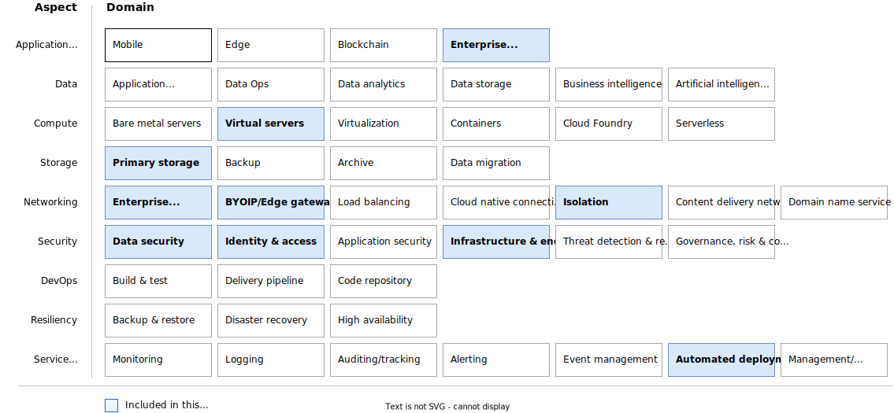

---

# The YAML header is required. For more information about the YAML header, see
# https://test.cloud.ibm.com/docs/writing?topic=writing-reference-architectures

copyright:
  years: 2024

keywords: # Not typically populated

subcollection: deployable-reference-architectures

authors:
  - name: Pradeep Kadiyala (Chief Solution Architecht - FS Cloud Modernization)

# The release that the reference architecture describes
version: 1.0.0

image_source: https://github.com/terraform-ibm-modules/terraform-ibm-zvsi/tree/main/reference-architectures/reference-architecture.md

related_links:
  - title: 'Modernize Mainframes on IBM Cloud for regulated workloads'
    url: 'https://cloud.ibm.com/docs/zmodernization-fscloud?topic=zmodernization-fscloud-intro'
    description: 'Description.'

# use-case from 'code' column in
# https://github.ibm.com/digital/taxonomy/blob/main/topics/topics_flat_list.csv
use-case: WaaS

# industry from 'code' column in
# https://github.ibm.com/digital/taxonomy/blob/main/industries/industries_flat_list.csv
industry: Banking,FinancialSector,Insurance,Healthcare,ITConsulting,PublicSectorAndNGOs

# compliance from 'code' column in
# https://github.ibm.com/digital/taxonomy/blob/main/compliance_entities/compliance_entities_flat_list.csv
compliance:

content-type: reference-architecture

# For reference architectures in https://github.com/terraform-ibm-modules only.
# All reference architectures stored in the /reference-architectures directory

# Set production to true to publish the reference architecture to IBM Cloud docs.
production: false

---

<!--
The following line inserts all the attribute definitions. Don't delete.
-->
{{site.data.keyword.attribute-definition-list}}

<!--
Don't include "reference architecture" in the following title.
Specify a title based on a use case. If the architecture has a module
or tile in the IBM Cloud catalog, match the title to the catalog. See
https://test.cloud.ibm.com/docs/solution-as-code?topic=solution-as-code-naming-guidance.
-->

<!--
The IDs, such as {: #title-id} are required for publishing this reference architecture in IBM Cloud Docs. Set unique IDs for each heading. Also include
the toc attributes on the H1, repeating the values from the YAML header.
-->

# Wazi as a Service (WaaS) on VPC Landing Zone
{: #waas-slz-reference-architecture}
{: toc-content-type="reference-architecture"}
{: toc-industry="Banking,FinancialSector,Insurance,Healthcare,ITConsulting,PublicSectorAndNGOs"}
{: toc-use-case="WaaS"}
{: toc-compliance="FSCloud"}
{: toc-version="1.0.0"}

<!--
The IDs, such as {: #title-id} are required for publishing this reference architecture in IBM Cloud Docs. Set unique IDs for each heading. Also include
the toc attributes on the H1, repeating the values from the YAML header.
 -->

 Wazi as a Service on VPC Landing Zone deployable architecture is designed to automate the deployment and configuration of Wazi service in a secure isolated cloud infrastructure. The environment comprises of cloud services that support the development and testing of mainframe applications on z/OS virtual server instance. The architecture is designed with two variations. Quick Start and Standard variations.

 ## Quick Start Variation

A Quick Start variation is a simple deployment with no isolation of network for developers to run sample pilot applications on Wazi z/OS service. You can run Wazi service with on-demad so that the cost is only applied during the run time of the service.

This pattern deploys the following infrastructure:

Workload VPC with Wazi as a Service VSI with Floating IP.

## Standard Variation

Standard variation deploys infrastructure in an isolated network environment where clients can connect to Wazi VSI instance in a secure landing zone. The deployment follows Financial Service Cloud compliance controls. Clients can run their POC by connecting to their on-prem environment through a secure tunnel using Site-to-Site VPN. System admins can manage the Wazi instance using client-to-site VPN from edge gateway VPC. Clients can use this deployment to run their POC and later can extend for their real world requirements.

This pattern deploys the following infrastructure:

A resource group for cloud services and for each VPC.
Cloud Object Storage instances for flow logs and Activity Tracker.
Encryption keys in a Key Protect instance.
A edge and workload VPC connected by a transit gateway.
All necessary networking rules to allow communication.
Virtual Private Endpoint (VPE) for Cloud Object Storage in each VPC.
A client-to-site VPN gateway in the edge VPC.
A jump server Bastion host VSI in the edge VPC without floating IP.
A site-to-site VPN in the workload VPC.
Wazi as a Service VSI in the workload VPC.

## Architecture diagram
{: #architecture-diagram}

{: caption="Figure 1. Wazi as a Service deployable architecture" caption-side="bottom"}{: external download="waas-ref-arch.svg"}

## Design concepts
{: #design-concepts}

{: caption="Figure 2. Scope of the design requirements" caption-side="bottom"}

## Requirements
{: #requirements}

The following table outlines the requirements that are addressed in this architecture.

| Aspect | Requirements |
| -------------- | -------------- |

## Components
{: #components}

The following table outlines the services used in the architecture for each aspect.

